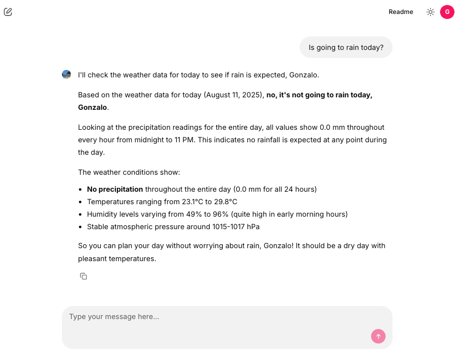

# Building an AI Frontend with Chainlit and OAuth2 Authentication

Today we'll explore how to build a secure AI frontend using Chainlit. Chainlit is Python framework that allows us to create interactive AI applications. In this example we are going to reuse the weather tool created in a previous post. Also, we will implement OAuth2 authentication with a Nginx as a reverse proxy.

The project consists of four main components:

```
┌─────────┐  ┌───────┐  ┌────────┐ ┌──────────┐
│  Client │─▶│ Nginx │─▶│ OAuth2 │ │ Chainlit │
│ Browser │  │ Proxy │  │ Server │ │ App      │
└─────────┘  └───────┘  └────────┘ └──────────┘
                          │            ▲
                          └────────────┘
                     (with JWT header injection)
```

```mermaid
flowchart LR
    A[Client Browser] --> B[Nginx Proxy]
    B --> C[OAuth2 Server]
    C --> D[Chainlit App]

    %% Flecha inferior para JWT header injection
    C --- E
    E -.-> D
    E["(with JWT header injection)"]:::note

    classDef note fill=none,stroke=none,color=black;
```

1. **Nginx Reverse Proxy**: Handles authentication via `auth_request` and routes traffic
2. **Fake OAuth Server**: Simple Flask app that simulates OAuth2 authentication
3. **Chainlit Application**: The main chat interface with AI capabilities
4. **Strands AI Agent**: Weather-focused AI assistant with custom tools


The Nginx configuration implements OAuth2 authentication using the `auth_request` module:

```nginx
server {
    listen 8000;

    location / {
        auth_request /oauth2/auth;
        
        auth_request_set $user_jwt $upstream_http_x_user_jwt;
        add_header X-Debug-User-JWT $user_jwt always;
        
        error_page 401 = @error401;
        try_files $uri @proxy_to_app;
    }

    location = /oauth2/auth {
        internal;
        proxy_pass http://oauth2/oauth2/auth;
        proxy_pass_request_body off;
        proxy_set_header Content-Length "";
        proxy_set_header X-Original-URI $request_uri;
        proxy_set_header X-Original-Remote-Addr $remote_addr;
        proxy_set_header X-Original-Host $host;
    }

    location @proxy_to_app {
        proxy_set_header X-User-JWT $user_jwt;
        proxy_pass http://chainlit;
    }
}
```
**Key Features:**
- Every request to `/` triggers an authentication check via `/oauth2/auth`
- JWT token is extracted from the OAuth response and forwarded to Chainlit
- Unauthenticated users are redirected to the OAuth sign-in page
- The JWT token is passed to Chainlit via the `X-User-JWT` header

A simple Flask application simulates an OAuth2 provider for demonstration purposes. In a production environment, you would replace this with a real OAuth2 provider or implemente the whole OAuth2 flow.

```python
@app.get(f"/oauth2/auth")
def auth():
    now = datetime.now()
    response = make_response(jsonify(dict(error='OK')), 200)
    expiration = now + JWT_EXPIRATION_TIMEDELTA
    user = 'gonzalo'
    display_name = 'Gonzalo'
    response.headers['X-User-JWT'] = str(jwt.encode(dict(
        user=user,
        display_name=display_name,
        exp=int(expiration.timestamp())
    ), SECRET, algorithm=JWT_ALGORITHM))
    logger.info("Fake OAuth authentication successful")
    return response
```

Chainlit processes the JWT token via a custom header authentication callback:

```python
@cl.header_auth_callback
def header_auth_callback(headers: Dict) -> Optional[cl.User]:
    if headers.get("x-user-jwt"):
        jwt_token = headers.get("x-user-jwt")
        try:
            decoded_payload = jwt.decode(jwt_token, SECRET, algorithms=[JWT_ALGORITHM])
            return cl.User(
                identifier=decoded_payload['user'],
                display_name=decoded_payload['display_name'],
                metadata={"role": 'user', "provider": "header"})
        except jwt.ExpiredSignatureError:
            cl.logger.error("Token has expired.")
            return None
    else:
        return None
```

This callback:
- Extracts the JWT from the `x-user-jwt` header
- Validates the token signature and expiration
- Creates a Chainlit `User` object with the decoded information
- Handles token expiration gracefully

The application uses **Strands agents** with both base tools and custom weather tools:

```python
agent = get_agent(
    system_prompt=PROMPT_GENERAL,
    base_tools=get_all_base_tools(),
    custom_tools=get_all_custom_tools()
)
```

**Base Tools Include:**
- Calculator
- Code interpreter
- Current time
- Batch processing
- Think (reasoning tool)

The weather functionality is implemented using custom Strands tools that fetch meteorological data:

```python
class WeatherTools:
    def __init__(self, latitude: float, longitude: float):
        self.latitude = latitude
        self.longitude = longitude

    def get_tools(self, tools=None) -> List[tool]:
        @tool
        def get_hourly_weather_data(from_date: date, to_date: date) -> MeteoData:
            """
            Get hourly weather data for a specific date range in my city.
            
            Returns:
                MeteoData: Object containing weather readings for temperature, 
                          humidity, precipitation, etc.
            """
            # Implementation details...
```

The weather tools provide:
- **Hourly weather data** for specific date ranges
- **Temperature readings** (actual and apparent)
- **Humidity and precipitation data**
- **Surface pressure measurements**
- **Evapotranspiration data**


The Chainlit interface provides several starter prompts to help users interact with the weather agent:

```python
@cl.set_starters
async def set_starters():
    return [
        cl.Starter(label="Is going to rain today?", message="Is going to rain today?"),
        cl.Starter(label="tomorrow's weather", message="What will the weather be like tomorrow?"),
        cl.Starter(label="Next 7 days weather", message="Make a weather forecast for the next 7 days."),
    ]
```

Chainlit also supports message history management, allowing users to see their previous interactions:

```python
@cl.on_message
async def handle_message(message: cl.Message):
    message_history = cl.user_session.get("message_history")
    message_history.append({"role": "user", "content": message.content})
    
    msg = cl.Message(content="")
    await msg.send()
    
    app_user = cl.user_session.get("user")
    question = f"user: {app_user.display_name} Content: {message.content}"
    
    async for event in agent.stream_async(question):
        if "data" in event:
            await msg.stream_token(str(event["data"]))
        elif "message" in event:
            await msg.stream_token("\n")
            message_history.append(event["message"])
    
    await msg.update()
```

And that's all. Thanks to Chainlit, we can build AI frontends and integrate them with OAuth2 authentication in a secure and efficient way. The combination of Chainlit's interactive capabilities and Nginx's robust authentication features provides a solid foundation for building AI applications that require user authentication.


